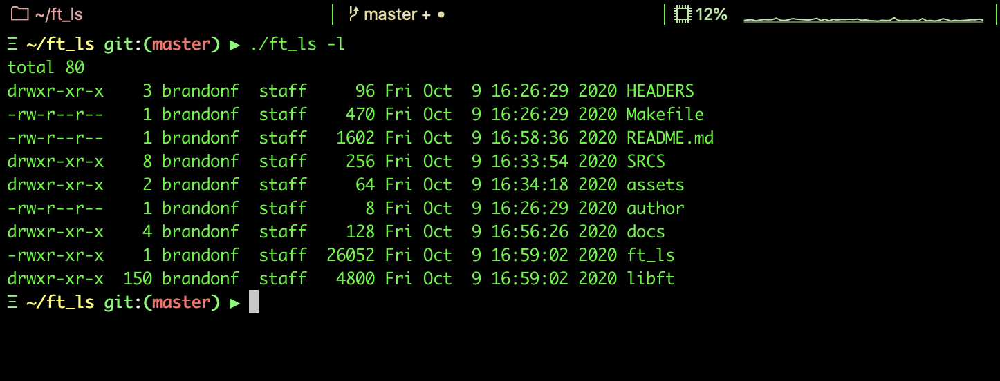

<p align="center">
  <div align="center">
   <br>
    <em><small><i>Shell unix command line interpreter .. but mini!</i></small></em>
  </div>
</p>

# Ls

My simple recreation of the famous unix command "ls" including several built in flag handlers. Such as:

* -l
* -a
* -r
* -t
* -R

Per the project, all of our functions must begin with ```ft_``` for, _Forty-Two_.

**Project Document:**
[ft_ls.pdf](https://github.com/elloimbrandon/ft_ls/blob/master/docs/ft_ls.en.pdf)

All functions were written according to 42's coding standard,
[the Norm](https://github.com/elloimbrandon/ft_ls/blob/master/docs/norme.en.pdf).


## Installation

Download the repository by copying and pasting the commands below.

```bash
git clone https://github.com/elloimbrandon/ft_ls.git

```

You can compile the library and executable using the Makefile:

Command       |  Action
:-------------|:-------------
`make`        | Compile the library.
`make clean`  | Remove object files.
`make fclean` | Remove object files and the library.
`make re`     | Re-compile the library.

## Usage

After compilation, run executable with supported flags.

```bash
./ft_ls <flag>
```

Flag          |  Action
:-------------|:-------------
`-l`          | List in long format.
`-a`          | Include directory entries whose names begin with a dot (.).
`-r`          | Reverse the order of the sort to get reverse lexicographical order or the oldest entries first (or largest files last, if combined with sort by size.
`-t`          | Sort by time modified (most recently modified first) before sorting the operands by lexicographical order.
`-R`          | Recursively list subdirectories encountered.

